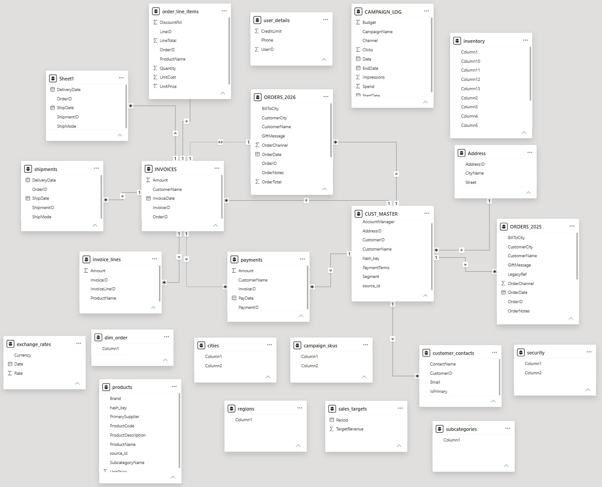
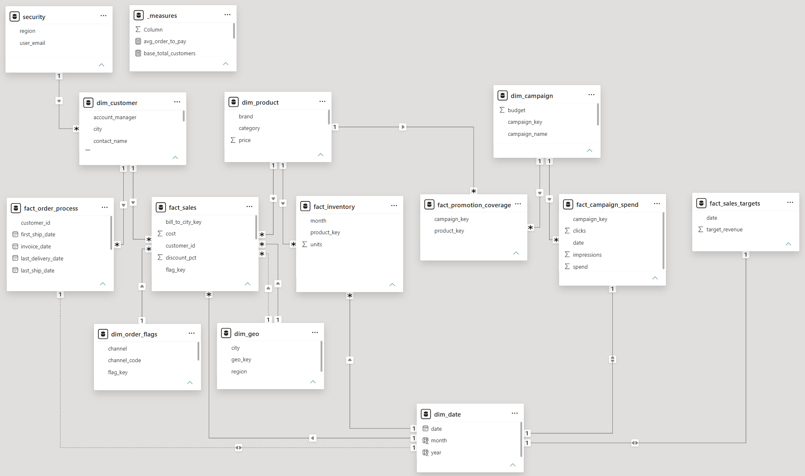
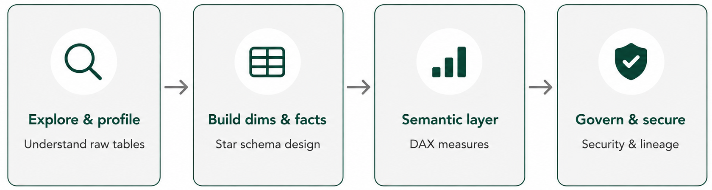
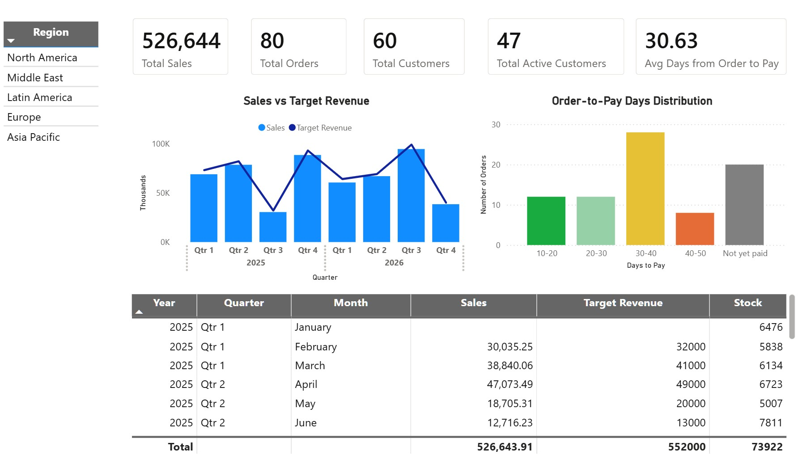
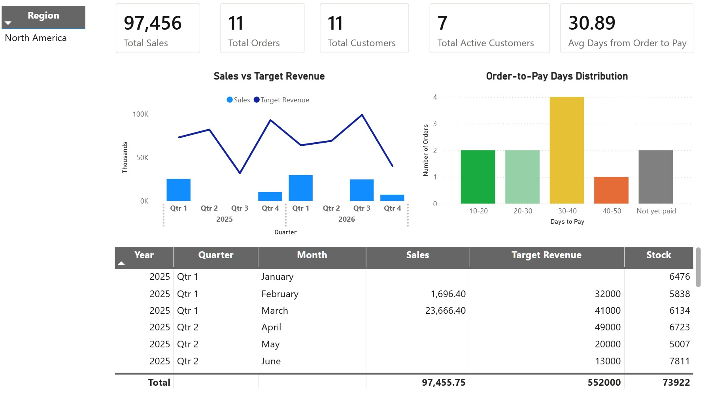

# Data-Modeling-From-Chaos-to-Star-Schema
A Power BI data modeling project transforming a disorganized 23 tables into a governed star schema, covering dimension/fact design, data quality remediation, DAX measures, and row-level security. The dataset simulates a B2B sales/marketing/fulfillment system and was intentionally structured to reproduce common production data issues.

## Source Tables → Final Data Model
| Source Tables | Final Data Model |
|---|---|
|  |  |

#### The problem of unstructured source tables:
- **Over-fragmented architecture** — 23 tables with no grouping by role or domain.
- **Tangled relational paths** — tables link with no clear structure, making it hard to trace where a number comes from.
- **Scattered business entities** — e.g. one customer's info split across several tables, orders split by year.
- **Data quality risks** — Placeholder column names, and several tables disconnected from the rest of the model.

## Methodology


## Result
- 6 fact tables covering 4 modeling patterns: transactional, accumulating snapshot, factless, and standalone
- 6 dimension tables, including a role-playing dimension (`dim_geo`), a junk dimension (`dim_order_flags`) and a DAX-generated calendar table (`dim_date`)
- 0 fact-to-fact relationships — all cross-fact analysis routed through shared dimensions
- Row-level security on regional access, verified against real user identities

## Power Query Organization
Queries are organized into numbered groups to separate raw source data from the transformed tables built on top of it as the model grows:

| Group | Contents |
|---|---|
| `01_Stage` | Raw queries, staged exactly as received from source systems — no transformations applied|
| `02_Dimensions` | Descriptive, mostly static tables that provide context for analysis |
| `03_Facts` | Transactional/event tables — records of something that happened, holding measures and dates, connected to dimensions via foreign keys |
| `04_Support` | Tables that are neither dim nor fact (e.g. security) |
| `Other Queries` | Newly connected tables/sources not yet triaged into a dimension, fact, or support role — working backlog |

## Phase 1 — Explore & Profile
### Data Source
Initial exploration pass over all 23 raw tables in dataset.xlsx — understanding *before* changing anything. The goal is to identify grain, candidate role (dimension / fact / junk / support), and known quality issues.

| No. | Table | Grain (1 row =) | Candidate role | Known issues |
|---|---|---|---|---|
| 01 | **CUST_MASTER** | 1 customer (company) | `dim_customer` core | Contains test row (CustomerID = 999) to filter out |
| 02 | **customer_contacts** | 1 contact (many per customer) | Merge into `dim_customer` | 1-to-many with `dim_customer` — must filter to primary before merge |
| 03 | **Address** | 1 address | Merge into `dim_customer` | — |
| 04 | **cities** | 1 city | Merge into `dim_customer` | Header row stored as data (needs promote-headers) |
| 05 | **regions** | 1 region | Redundant — info already present via **cities** | Do not merge separately (duplicate context) |
| 06 | **user_details** | 1 customer (despite "user" naming) | Merge into `dim_customer` | Naming inconsistency: `user_id` here vs. `customer_id` elsewhere — same entity |
| 07 | **products** | 1 product | `dim_product` core | — |
| 08 | **subcategories** | 1 subcategory | Merge into `dim_product` | Combined category|subcategory column, needs split |
| 09 | **ORDERS_2025** | 1 order | `fact_sales` header source | Have `LegacyRef` an `SourceFile` columns not present in 2026 |
| 10 | **ORDERS_2026** | 1 order | `fact_sales` header source | Missing `LegacyRef` and `SourceFile` vs. 2025 |
| 11 | **order_line_items** | 1 order line | `fact_sales` detail | — |
| 12 | **inventory** | 1 product (wide, 1 column per month) | `fact_inventory` | Wide format — needs unpivot |
| 13 | **CAMPAIGN_LOG** | 1 campaign, 1 day | Split: `dim_campaign` + `fact_campaign_spend` | Mixes static attrs (CampaignName, Channel, StartDate, EndDate, Budget) with daily transactions (Spend, Clicks, Impressions) |
| 14 | **campaign_skus** | 1 campaign | Source for `fact_promotion_coverage` | Product list stored as delimited string in one cell;  Header row stored as data |
| 15 | **INVOICES** | 1 invoice | invoices header | — |
| 16 | **invoice_lines** | 1 invoice line | invoice detail | — |
| 17 | **shipments** | 1 shipment | Date source for `fact_order_process` (shipment_date, delivery_date) | Multiple shipments per order (partial shipments) — needs Group By before merge to avoid fan-out |
| 18 | **payments** | 1 payment | Date source for `fact_order_process` (payment_date) | Some invoices have multiple payments whose sum can exceed the invoice amount — needs validation |
| 19 | **sales_targets** | 1 month | Source for `fact_sales_targets` | Missing 2025-01 and 2025-08 |
| 20 | **exchange_rates** | 1 currency, 1 date | Deactivated | No relatable key to connect to the model; kept in case a future use case needs it |
| 21 | **security** | 1 employee | Support (RLS) | Header row stored as data |
| 22 | **sheet1** | 1 shipment | Duplicate of `shipments` | Identical to `shipments` — import artifact, remove |
| 23 | **dim_order** | unclear — single unlinked ID column | Junk, drop | No relatable context, remove |

### Intermediate Tables
Not part of the final model — staging tables used to build `dim_order_flags`.

| Table | Built from | Purpose |
|---|---|---|
| **orders** | **ORDERS_2025** and **ORDERS_2026** | Combines all records via UNION ALL (append), forming a single unified orders dataset |
| **channels** | New lookup table | Maps `OrderChannel` code to its display name |
| **shipments_agg** | shipments | Pre-aggregates **shipments** to order-level grain prior to merge into `fact_order_process` |

## Phase 2 — Build Dimensions & Facts
### Data Model Architecture
The model follows a star schema design (a galaxy schema, given multiple fact tables) with these characteristics:

* Multiple fact tables, each with its own grain
* Denormalized dimension tables
* One relationship per fact–dimension pair, except deliberate role-playing dimensions
* No direct relationships between fact tables — shared dimensions connect them instead

### Dimension Tables
| Table | Role | Notes |
|---|---|---|
| `dim_customer` | Standard | Consolidated from 6 source tables |
| `dim_product` | Standard | Deduplicated on business key (product code) |
| `dim_order_flags` | Junk | Combines `OrderChannel`, `Status`, `Priority` from **orders**; channel names mapped via **channels** |
| `dim_geo` | Role-playing | Connected to fact_sales twice (ship-to active, bill-to inactive via `USERELATIONSHIP`) |
| `dim_campaign` | Standard | Static attributes only — split from CAMPAIGN_LOG |
| `dim_date` | Shared/conformed | Built with `CALENDARAUTO()`, connects to nearly every fact |

### Fact Tables
| Table | Grain | Type | Connects to |
|---|---|---|---|
| `fact_sales` | 1 order line | Transactional | dim_customer, dim_product, dim_geo (ship/bill), dim_order_flags, dim_date |
| `fact_inventory` | 1 product, 1 month | Transactional | dim_product, dim_date |
| `fact_campaign_spend` | 1 campaign, 1 day | Transactional | dim_campaign, dim_date |
| `fact_promotion_coverage` | 1 campaign–product pair | Factless | dim_campaign, dim_product |
| `fact_order_process` | 1 order | Accumulating snapshot | dim_customer, dim_date |
| `fact_sales_targets` | 1 month | Standalone | dim_date |

### Design Rationale
- **Entity naming resolved as "customer," not "user"** (`dim_customer` build) — same entity, two source-system names; standardized on the majority term instead of keeping both.
- **RLS on `dim_customer`, not `dim_geo`** — `dim_customer` connects to two facts (`fact_sales`, `fact_order_process`), so one role secures both; `dim_geo` only connects to `fact_sales`, so the same role would secure just one.
- **`dim_geo` as a role-playing dimension** — one physical table serves both ship-to and bill-to via an active/inactive relationship pair, instead of duplicating the table.
- **`fact_order_process` as an accumulating snapshot, not separate facts per stage** — avoids duplicating the same dollar amount across orders/shipments/invoices/payments, and supports process-flow questions (e.g. days from order to payment) directly.
- **`fact_promotion_coverage` as a factless fact** — tracks campaign-product association with no numeric measure, since the business question is "was it covered," not "how much."

## Phase 3 — Semantic Layer
### Measures
All core metrics live in one `_measures` table. This is the single source of truth — every report pulls the same number for the same metric, instead of each dashboard defining it independently.

| Measure | DAX |
|---|---|
| `Total Sales` | `SUM(fact_sales[line_total])` |
| `Total Orders` | `DISTINCTCOUNT(fact_sales[order_id])` |
| `Total Active Customers` | `DISTINCTCOUNT(fact_sales[customer_id])` |
| `Total Customers` | `COUNT(dim_customer[customer_id])` |
| `Average Order to Pay` | `AVERAGE(fact_order_process[order_to_pay])` |

Notes:
- `Total Orders` uses `DISTINCTCOUNT`, not `COUNT` — `fact_sales` is grained at the order line, so a plain count would overcount orders.
- `Total Active Customers` and `Total Customers` are paired on purpose so you can see how many customers are actually ordering vs. the full customer base.
- `Average Order to Pay` runs on a row-level `DATEDIFF(order_date, pay_date, DAY)` computed on the accumulating snapshot fact (`fact_order_process`).

### What This Model Enables
Beyond the five core measures, the fact tables support ad-hoc analysis that does not need a pre-built measure:

- **Sales**: trends by period/product/region, actual vs. target (`fact_sales` + `fact_sales_targets` via `dim_date`), channel mix
- **Fulfillment**: bottleneck stage across order → ship → deliver → invoice → pay
- **Inventory**: stock trend vs. sales velocity (`fact_inventory` + `fact_sales` via `dim_product`)
- **Marketing**: spend efficiency, sales lift on campaign-covered products (`fact_promotion_coverage` + `fact_sales` via `dim_product`)

## Phase 4 — Govern & Secure

**Row-level security** — implemented on `dim_customer`, filtering by region:

```dax
[region] = LOOKUPVALUE(security[region], security[user_email], USERPRINCIPALNAME())
```
If a user has no matching row in the security table, LOOKUPVALUE returns blank and the role filter resolves to no rows — such a user sees an empty model rather than an error, so every viewer needs an entry in security before being granted access.

Verified using Power BI's *View As* feature against real user identities. With no role applied, the model reflects all regions; viewed as a specific region, both `dim_customer`- connected facts (`fact_sales`,`fact_order_process`) filter down to that region only.

| No role applied | Viewed as North America |
|---|---|
|  |  |

## Naming Conventions

| Category | Convention |
|---|---|
| Case | snake_case, all tables and columns |
| Fact tables | `fact_` prefix |
| Dimension tables | `dim_` prefix |
| Surrogate keys | `_key` suffix (model-generated, e.g. `customer_key`) |
| Natural keys | retained as sourced (e.g. `customer_id`) |

## Tools Used
+ Power BI Desktop
+ Excel (source data)

## Acknowledgments
*Inspired by [Data with Baraa's Power BI Data Modeling Portfolio Project End-to-End (Nightmare Data Model)](https://www.youtube.com/watch?v=0A2k62YEbfI).*
